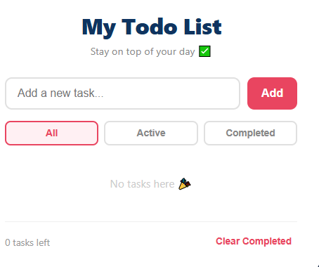

# ✅ Todo App

### 🔗 Live Demo 
[Try the Todo App here →](https://peter-akacha.github.io/todo-app)

A clean, responsive task management web application. Add, complete, and delete tasks with data saved in your browser.

### 📸 Screenshot

<!-- We’ll add this next -->

### 🛠 Tech Stack
- **Frontend**: HTML5, CSS3, Vanilla JavaScript
- **Features**: Add/Delete tasks, Mark complete/incomplete, LocalStorage to save tasks, Fully mobile responsive
- **No frameworks**: Pure JS so you can see my core skills

### ⚙️ How to Run Locally
```bash
git clone https://github.com/Peter-Akacha/todo-app.git
cd todo-app
open index.html
